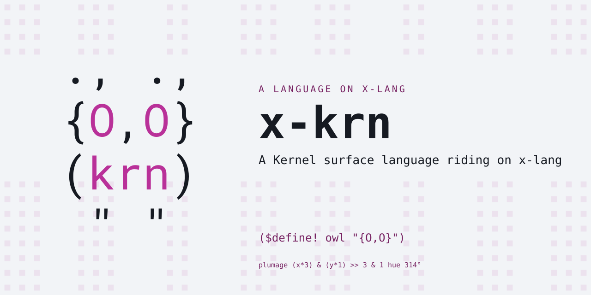
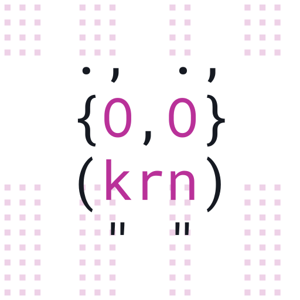

# x-krn — Kernel on x-lang

<p align="center"></p>

A [Kernel](https://web.cs.wpi.edu/~jshutt/kernel.html) surface language riding
on [x-lang](https://github.com/jonruttan/x-lang). Operatives (`$vau`) are
first-class; applicatives derive from them via `wrap`. Same s-expressions as
Scheme, the opposite evaluation model.

```
$ x -l krn
Kernel 0.1.0
>> ($define! (sq x) (* x x))
>> (sq 9)
81
>> (member 'b '(a b c))
(b c)
```

x-krn is a **lang**: a surface syntax loaded over an x-lang dialect, so a
spelling shared with x-lang can mean something different here: `(b c)` above is
Kernel's own printer, not x-lang's `('b 'c)`. The terms are in x-lang's
[lang contract](https://github.com/jonruttan/x-lang/blob/main/docs/lang-contract.md).

## Status

Early. 74 specs, all green against x-lang **v0.13.0**, the release `lang.xon`
declares. CI runs the declared release and `main`, so a platform change that
breaks this bundle shows up as a red build.

## Install

From any directory, nothing cloned:

```bash
x --install-lang https://github.com/jonruttan/x-krn/releases/latest/download/lang.pin.xon
x -l krn
```

x fetches the published pin, then the tarball it names, verifies the digest,
and installs to `<share>/langs/krn`, where `x -l` looks. A failed upgrade
leaves the working install untouched.

From a clone:

```bash
make install                      # into the x on your PATH
PREFIX=$HOME/.local make install  # or a particular prefix
```

`make uninstall` removes it either way.

`x` resolves langs relative to the directory it runs in. Inside an x-lang
checkout it searches `deps/langs/` only, so an installed lang is not found
there:

```
$ cd path/to/x-lang && x -l krn
Error: no library, app or lang named 'krn'
  searched lib/krn.x, apps/krn/run.x
      and deps/langs/*/lang.xon
```

Run `x` from another directory, or set `X_LANG_DIR`, which takes precedence in
both cases:

```bash
X_LANG_DIR=$HOME/.local/share/x/langs/ x -l krn   # the installed one
X_LANG_DIR=/path/to/x-krn/.. x -l krn             # a checkout, uninstalled
```

## Pin it for a project

An install is unversioned and machine-wide. When a project must build against
a specific version, pin it: `Pin bundle` fetches the release tarball and
verifies it against a digest before unpacking. In the project's
`lang.pin.xon`:

```x
(lang "krn")
(release "v0.1.3")
(bundle "sha256:…" "https://github.com/jonruttan/x-krn/releases/download/v0.1.3/x-krn-v0.1.3.tar.gz")
(source "https://github.com/jonruttan/x-krn.git")
```

Each release's notes carry this block with its digest, ready to paste. Then:

```x-repl
> (import x/tool/pin)
> (Pin bundle "deps/langs")
"deps/langs/krn-v0.1.3"
```

`deps/langs/` is where `x -l` looks in a checkout; `X_LANG_DIR` overrides it.

Install when you just want `x -l krn` to work. Pin when a build depends on it:
the digest is what makes the version reproducible.

## Running it

```bash
x -l krn                 # interactive
x -l krn -f program.krn  # batch
```

x-lang boots the dialect `lang.xon` declares, arms this bundle's module root,
and loads `run.x` on top.

## The language

Kernel's core, on helium:

| | |
|---|---|
| operatives | `$vau`, `$define!`, `$lambda`, `$let`, `$letrec`, `$if`, `$cond`, `$sequence` |
| environments | `get-current-environment`, `make-environment` |
| predicates | `applicative?`, `operative?`, `boolean?`, `inert?`, `null?`, `pair?`, `symbol?` |
| lists | `cons`/`car`/`cdr`, `list`, `append`, `map`, `member`, `length`, `reverse` |

`$define!` binds in its caller's environment; internal definitions in a
`$lambda` body bind locally, rewritten at construction time.

## Layout

```
lang.xon               name, dialect, and the x-lang release this pairs with
run.x                  the entry point
krn/base.x             the language
krn/printer.x          Kernel's own result writer
krn/constructs.x       construct declarations (formatter metadata)
tests/spec-runner.sh   sources the platform's shared runner
tests/gen-harness.sh   writes tests/lib/harness.gen.x (generated, never committed)
tests/specs/*.spec.md  the suite
tools/bundle.sh        rolls a release tarball and prints its pin
Makefile               install / uninstall / test / bundle
```

No file here carries a path literal, `run.x` included, and CI enforces it.

## Development

Run the specs against an x-lang checkout or install:

```bash
X=/path/to/x-lang/x.sh sh tests/spec-runner.sh
```

Pass `X` explicitly: without it the suite takes the `x` on your PATH, and an
installed x that trails the checkout reports failures the platform has already
fixed.

Do not `make install` into an x-lang checkout. The Makefile asks
`$(X) --share-dir` where to put the bundle, and a checkout answers with its own
root, so the files land in `<checkout>/langs/krn`, which `-l` does not search
there. The install reports success and the lang is still not found. Install
into a real `<share>` tree, or use `X_LANG_DIR`.

Roll a release tarball locally, with the digest a consumer would pin:

```bash
sh tools/bundle.sh v0.1.3
```

The tarball is byte-reproducible: it is built from the tag with `git archive`
and a timestamp-free gzip, so the same tag always yields the same digest.
Pushing a `v*` tag runs the suite and, only if it is green, publishes the
tarball and its `.sha256` as a GitHub release.

## Background

Kernel is John N. Shutt's language, worked out in his WPI dissertation and
specified in the R-1RK report. Its claim is that the fexpr — Lisp's oldest and
most disreputable idea, dropped from mainstream Lisps in the 1980s for being
hard to reason about — becomes sound once environments are first-class values.
So the *operative* is the primitive: `$vau` receives its operands unevaluated
together with its caller's environment, and ordinary applicative functions
derive from operatives by `wrap` rather than the other way around. Shutt died
in 2021 with the design still unfinished; the R-1RK remains the reference, and
this bundle implements a small core of it.

- [The Kernel Programming Language](https://web.cs.wpi.edu/~jshutt/kernel.html) — Shutt's page, with the reports
- [R-1RK](https://ftp.cs.wpi.edu/pub/techreports/pdf/05-07.pdf) — the *Revised⁻¹ Report on the Kernel Programming Language*
- [Fexpr](https://en.wikipedia.org/wiki/Fexpr) on Wikipedia — the idea's history, and where Kernel sits in it

## Licence

MIT No Attribution (MIT-0). See [LICENSE](LICENSE).

<p align="center"></p>
